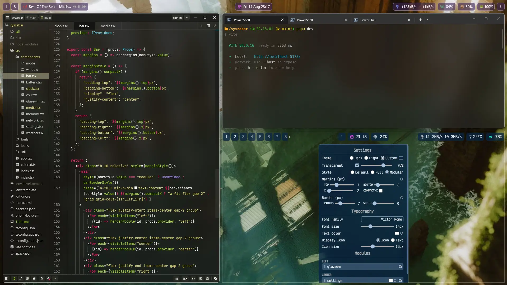

# SysZebar

A customizable bar for [Zebar](https://github.com/glzr-io/zebar).

## Screenshots



## Features

- **Modules**: workspaces [GlazeWM](https://github.com/glzr-io/glazewm), media controls, clock, network, memory, cpu, battery, weather and settings.
- **Three bar styles**: `default`, `full` and `modular` (per-module boxes).
- **Themes**: `dark`, `light` and `custom` (any accent color, derived in OKLCH), with transparency + opacity control.
- **Typography**: font family, font size, icon size and text/icon colors.
- **Per-module controls**: show/hide, drag & drop reorder between columns, and individual icon colors.
- **Display modes**: icon-only or text-label rendering.
- **Clock**: click to cycle time/datetime formats (duration-only or combined).
- **Media**: now-playing label with play/pause/previous/next controls and a spinning vinyl icon while playing.

## Requirements

- Windows 10/11
- [Zebar](https://github.com/glzr-io/zebar/releases) v3.3.1

## Installation

### Marketplace

Install SysZebar directly from the Zebar marketplace.

### Manual

Clone or download the repository, build it (see [Development](#development)) and copy the project folder into `~/.glzr/zebar/` so it contains a `zpack.json`:

```
~/.glzr/zebar/
└── syszebar/
    ├── zpack.json
    └── dist/
```

Then add the `syszebar` widget from the **My widgets** tab in the Zebar GUI.

## Development

```sh
# install dependencies
pnpm install

# dev mode (mock providers, no Zebar needed)
pnpm dev

# production build (real providers, outputs to dist/)
pnpm build
```

`VITE_MODE` decides which providers load:

- `VITE_MODE=dev` → `DevMode`, all mock data (see `src/util/mock.ts`), useful to iterate on UI without a running environment.
- Anything else → `ProdMode`, real Zebar providers driven by the settings panel.

### Dev preview (transparency)
A regular browser renders the bar on an opaque background, so transparent/alpha
effects are hard to preview in dev. Use [popup-browser](https://github.com/joarieldev/popup-browser),
a frameless, transparent Electron window.

### Project structure

```
src/
├── components/
│   ├── bar.tsx          # bar layout + module rendering
│   ├── window/          # settings panel UI
│   └── mode/            # DevMode (mock) / ProdMode (real providers)
├── icons/               # inline SVG icons
└── util/                # stores, providers config and persistence
```

## License

[MIT](LICENSE)
